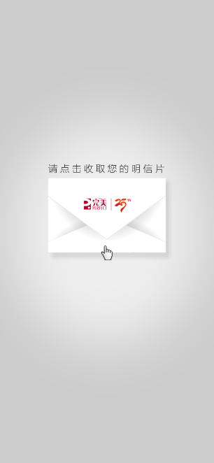

## 2019明信片

[‌http://www.perfect99.com/weixinH5/2019/postcard/Belarus/index_Belarus_new.html](‌http://www.perfect99.com/weixinH5/2019/postcard/Belarus/index_Belarus_new.html)
[‌http://www.perfect99.com/weixinH5/2019/postcard/Thailand/index_Thailand.html](‌http://www.perfect99.com/weixinH5/2019/postcard/Thailand/index_Thailand.html)



## 2018 邀请函

- 马来西亚
[http://www.perfect99.com/weixinH5/2018/yth/MaLetter/Default2.aspx?kh=46976164](http://www.perfect99.com/weixinH5/2018/yth/MaLetter/Default2.aspx?kh=46976164)
- 英国
[http://www.perfect99.com/weixinH5/2018/yth/UKLetter/Default2.aspx?kh=26733813](http://www.perfect99.com/weixinH5/2018/yth/UKLetter/Default2.aspx?kh=26733813)
- 菲律宾
[http://www.perfect99.com/weixinH5/2018/yth/FLBLetter/Default2.aspx?kh=00078422](http://www.perfect99.com/weixinH5/2018/yth/FLBLetter/Default2.aspx?kh=00078422)

英国和菲律宾需要设置浏览器User-agent（后台根据`micromessenger`字符串判断是否微信）
```text
mozilla/5.0 (iphone; cpu iphone os 9_1 like mac os x) applewebkit/601.1.46 (khtml, like gecko) version/9.0 mobile/13b143 safari/601.1 wechatdevtools/1.02.1904090 micromessenger/6.5.7 language/zh_cn webview/15604107378912590 webdebugger port/28065
```

## 海外研讨会鼓励明信片
[http://www.perfect99.com/DC/2018YTHcard/mD1.aspx?k=32693261](http://www.perfect99.com/DC/2018YTHcard/mD1.aspx?k=32693261)
