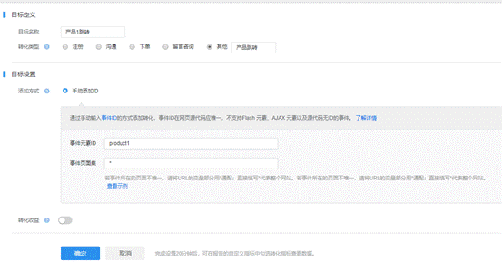

访问分析=>页面点击图可以查看链接点击数量


访问分析=>事件分析可以查看自定义事件，然后可以设置转化


```javascript
_hmt.push(['_trackEvent', 'video', 'play', 'Hey Jude']);
// 一定要填写类型，操作，标签三个参数
```

在控制台执行会立刻发送hm.gif的请求!


设置事件转化的要点，事件页面集不用加http前缀, 输入*代表全部网站，

输入[www.perfect99.com/product/](http://www.perfect99.com/product/)* 才代表有这个/product/前缀的所有网址



然后在实际的网页中点击，即便是点击跳转了，也可以看到发送了hm.gif的请求


